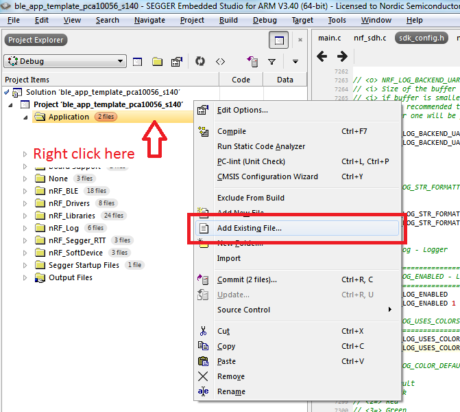
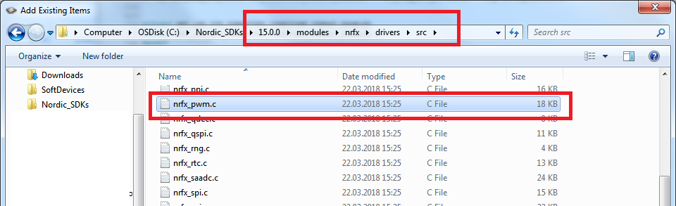
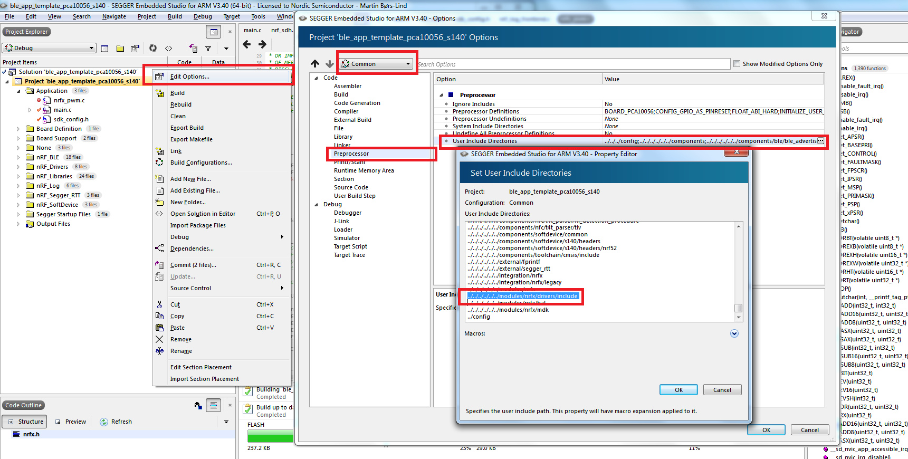
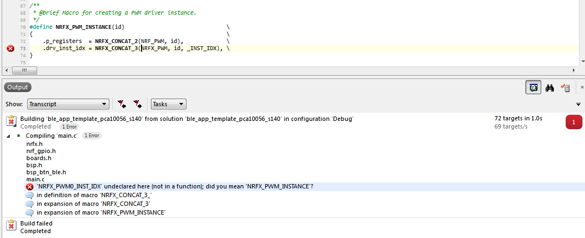

# Part 2: Adding the PWM driver
The goal of this workshop is to control an SG90 Servo ([Datahseet](http://www.ee.ic.ac.uk/pcheung/teaching/DE1_EE/stores/sg90_datasheet.pdf)) with a phone using BLE. The rotation of the servo arm is manipulated using a PWM signal with varying duty-cycle. 

In this part of the workshop we will add the necessary PWM driver files to our project, initiate the drivers, and implement a simple function for control the servo.  

## Adding files to our project
1. The first thing we need to do is to add the PWM driver source code to our project. Do that by righclicking on the "Application" folder in the Project Item vindow and click "Add Existing File":

    

1. Navigate to _"..\your_sdk_15_folder\modules\nrfx\drivers\src"_ and add the file _nrfx_pwm.c_.

    

1. We also need to make sure that the path to the corresponding include file, _nrfx_pwm.h_, is included in our project settings. So enter your project options again, set the Release/Debug configuration to 'Common', select Preprocessor, and check that _"../../../../../../modules/nrfx/drivers/include"_ is included in "User Include Directories".

    

1. Finally, include the header file in main.c:

    ````c
    #include "nrfx_pwm.h"
    ````

Now we should be ready to use the PWM driver in our project. 

## Initialize the PWM driver
Many of the drivers and libraries in Nordic's SDK are configured and initialized by filling out a "configuration structure" which is then passed into an drier init() function. This is what we are going to do to configure the PWM driver too. 

1. We start by declaring a [PWM driver instance structure](http://infocenter.nordicsemi.com/topic/com.nordic.infocenter.sdk5.v15.0.0/structnrfx__pwm__t.html?cp=4_0_0_6_9_0_12_1_1). Then we define a function called `init_pwm()` where we configure and initialize the peripheral. Inside the function we fill out a [PWM driver configuration structure](http://infocenter.nordicsemi.com/index.jsp?topic=%2Fcom.nordic.infocenter.sdk5.v15.0.0%2Fstructnrfx__pwm__config__t.html). Finally, we pass these two structures into the [PWM driver initialization function](http://infocenter.nordicsemi.com/topic/com.nordic.infocenter.sdk5.v15.0.0/group__nrfx__pwm.html#gaf06bb9053293005bc91217e5a1791261). 

    Add this code to main.c: 

    ````c
        // Declare a PWM driver instance structure
        nrfx_pwm_t m_pwm0 = NRFX_PWM_INSTANCE(0);

        // Function for initializing the PWM
        void init_pwm(void)
        {
            uint32_t err_code;

            // Fill out the 
            nrfx_pwm_config_t const config0 =
            {
                .output_pins =
                {
                    BSP_LED_0, // channel 0
                    NRFX_PWM_PIN_NOT_USED,             // channel 1
                    NRFX_PWM_PIN_NOT_USED,             // channel 2
                    NRFX_PWM_PIN_NOT_USED,             // channel 3
                },
                .irq_priority = APP_IRQ_PRIORITY_LOW,
                .base_clock   = NRF_PWM_CLK_1MHz,
                .count_mode   = NRF_PWM_MODE_UP,
                .top_value    = 1000,
                .load_mode    = NRF_PWM_LOAD_COMMON,
                .step_mode    = NRF_PWM_STEP_AUTO
            };
            err_code = nrfx_pwm_init(&m_pwm0, &config0, NULL);
            APP_ERROR_CHECK(err_code);
        }
    ````

1. Try to compile. If you have followed the tutorial it should fail with this warning:

    

1. This is because we have not yet enabled the PWM driver in the sdk_config.h file. To enable the driver, search for ``NRFX_PWM_ENABLED`` in _sdk_config.h_ and set it to 1. 

1. The [PWM](http://infocenter.nordicsemi.com/topic/com.nordic.infocenter.nrf52840.ps/pwm.html?cp=2_0_0_5_16) peripheral in the nRF52840 consists of 4 sepparate modules, also known as instances. Each instance can manage 4 different PWM channels with the nRF52840. This allows you to control up to 16 individual PWM channeles. In our case we will use PWM instance 0, and we need to enable this instance in _sdk_config.h_ as well. Do this by searching for ``NRFX_PWM0_ENABLED`` and set it to 1.

## Test Servo