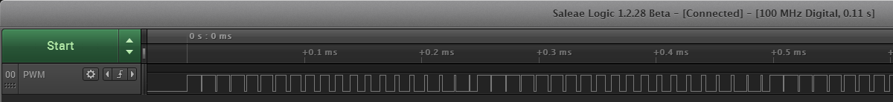
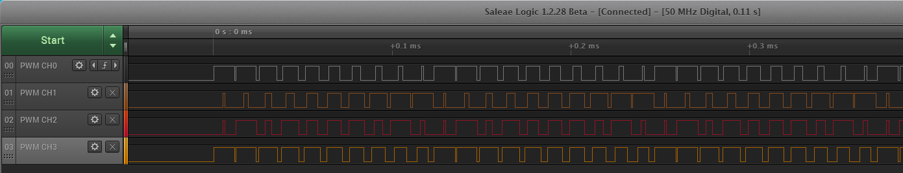
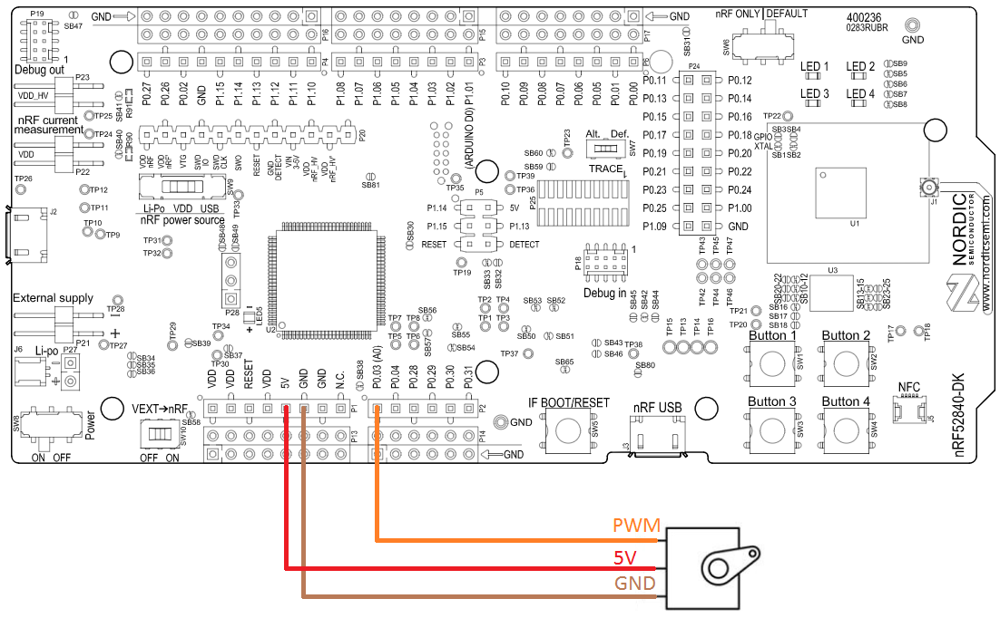
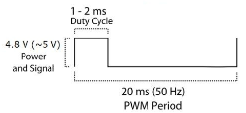
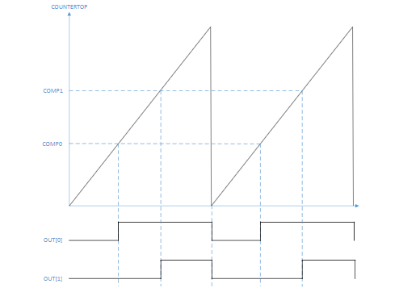
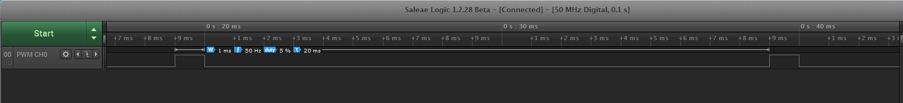

# Part 2: Adding the PWM driver
The goal of this workshop is to control a servo ([SG90 Datahseet](http://www.ee.ic.ac.uk/pcheung/teaching/DE1_EE/stores/sg90_datasheet.pdf)) with a phone using BLE. The angle of the servo arm is manipulated using a PWM signal with varying duty cycle, so in this next part of the workshop we will add the necessary PWM driver files to our project, initiate the drivers, and implement a simple function for controlling the servo.  

## The nRF52840's PWM Peripheral
The [PWM](http://infocenter.nordicsemi.com/topic/com.nordic.infocenter.nrf52840.ps/pwm.html?cp=2_0_0_5_16) peripheral in the nRF52840 includes four separate instances, also known as modules. Each instance controls groups of four different PWM channels. This allows you to control up to 16 individual PWM channeles.

## Adding files to our project
1. The first thing we need to do is to add the [PWM driver's](http://infocenter.nordicsemi.com/topic/com.nordic.infocenter.sdk5.v15.0.0/hardware_driver_pwm.html?cp=4_0_0_2_0_8) source code to our project. Do that by righclicking on the "Application" folder in the Project Item vindow and click "Add Existing File":

    

1. Navigate to _"..\your_sdk_15_folder\modules\nrfx\drivers\src"_ and add the file _nrfx_pwm.c_.

    

1. We also need to make sure that the path to the corresponding include file, _nrfx_pwm.h_, is included in our project settings. So enter your project options again, set the Release/Debug configuration to 'Common', select Preprocessor, and check that _"../../../../../../modules/nrfx/drivers/include"_ is included in "User Include Directories".

    

1. Finally, include the header file in main.c:

    ````c
    #include "nrfx_pwm.h"
    ````

Now we should be ready to use the PWM driver in our project. 

## Initialize the PWM driver
Many of the drivers and libraries in Nordic's SDK are configured and initialized by filling out a configuration structure which is then passed into a driver init() function. In many cases, the configuration structure includes sub-structures and dozens of parameters. Luckily, the parameters usually defaults to 0, so usually you will get away with configuring only the parameters that matters to you. There migh also be macros you can use to fill out the parameters. This is how we are going to configure the PWM driver as well. 

1. We start by declaring a [PWM driver instance structure](http://infocenter.nordicsemi.com/topic/com.nordic.infocenter.sdk5.v15.0.0/structnrfx__pwm__t.html?cp=4_0_0_6_9_0_12_1_1). Add this line of code somewhere at the top of main.c: 
    ````c
        // Declare a PWM driver instance structure
        nrfx_pwm_t m_pwm0 = NRFX_PWM_INSTANCE(0);
    ````

1. Then we define a function called `init_pwm()` where we configure and initialize the peripheral. Inside the function we fill out a [PWM driver configuration structure](http://infocenter.nordicsemi.com/index.jsp?topic=%2Fcom.nordic.infocenter.sdk5.v15.0.0%2Fstructnrfx__pwm__config__t.html). Finally, we pass these two structures into the [PWM driver initialization function](http://infocenter.nordicsemi.com/topic/com.nordic.infocenter.sdk5.v15.0.0/group__nrfx__pwm.html#gaf06bb9053293005bc91217e5a1791261). And of course we check the return code with `APP_ERROR_CHECK(err_code)` afterwards.

    Add this code to main.c: 

    ````c
        // Function for initializing the PWM
        void init_pwm(void)
        {
            uint32_t err_code;
            // Declare a configuration structure and use a macro to instantiate it with default parameters.
            nrfx_pwm_config_t pwm_config = NRFX_PWM_DEFAULT_CONFIG;

            // We must override some of the parameters:
            pwm_config.output_pins[0] = LED_1; // Connect LED_1 on the nRF52840 DK to PWM Channel 0
            pwm_config.output_pins[1] = LED_2; // Connect LED_2 on the nRF52840 DK to PWM Channel 1
            pwm_config.output_pins[2] = LED_3; // Connect LED_3 on the nRF52840 DK to PWM Channel 2
            pwm_config.output_pins[3] = LED_4; // Connect LED_4 on the nRF52840 DK to PWM Channel 3
            pwm_config.top_value    = 20000; // Make PWM count from 0 - 10,000
            pwm_config.load_mode    = NRF_PWM_LOAD_INDIVIDUAL; // Use indivitual duty cycle for each PWM channel
            
            // Pass config structure into driver init() function 
            err_code = nrfx_pwm_init(&m_pwm0, &pwm_config, NULL);
            APP_ERROR_CHECK(err_code);
        }
    ````

1. Try to compile. If you have followed the tutorial it should fail with this error:

    

1. This is because we have not yet enabled the PWM driver in _sdk_config.h_. To enable the driver, search for ``NRFX_PWM_ENABLED`` in _sdk_config.h_ and set it to 1. 

1. We also explicitly need to enable instance 0 in _sdk_config.h_. Do this by searching for ``NRFX_PWM0_ENABLED`` and set it to 1.

1. Declare a static [nrf_pwm_values_individual_t](http://infocenter.nordicsemi.com/topic/com.nordic.infocenter.sdk5.v15.0.0/structnrf__pwm__values__individual__t.html?resultof=%22%6e%72%66%5f%70%77%6d%5f%76%61%6c%75%65%73%5f%69%6e%64%69%76%69%64%75%61%6c%5f%74%22%20) structure where we can put indivitual values for each the PWM channels:

    ````c
    // Structure for defining duty cycle values for sequences
    static nrf_pwm_values_individual_t pwm_duty_cycle_values = 
    {
        .channel_0 = 500, //< Duty cycle value for channel 0.
        .channel_1 = 3000, //< Duty cycle value for channel 1.
        .channel_2 = 8000, //< Duty cycle value for channel 2.
        .channel_3 = 20000  //< Duty cycle value for channel 3.
    };

    ````

1. Then declare a static [nrf_pwm_sequence_t](http://infocenter.nordicsemi.com/topic/com.nordic.infocenter.sdk5.v15.0.0/structnrf__pwm__sequence__t.html?resultof=%22%6e%72%66%5f%70%77%6d%5f%73%65%71%75%65%6e%63%65%5f%74%22%20) structure where we can define the behaviour of the PWM sequence (more about sequences in the Bonus Task below). 

    ````c
    // Structure for defining a sequence of PWM duty cycles
    static nrf_pwm_sequence_t pwm_sequence =
    {
        .values.p_individual = &pwm_duty_cycle_values,
        .length          = (sizeof(pwm_duty_cycle_values) / sizeof(uint16_t)),
        .repeats         = 0,
        .end_delay       = 0
    };
    ````

1. Finally, in your main() function, below the line:

    ````c
    // Start execution.
    NRF_LOG_INFO("Template example started.");
    ````

    call the PWM initialization function and start the PWM "playback" of our sequence: 
    
    ````c
    init_pwm();
    nrfx_pwm_simple_playback(&m_pwm0, &pwm_sequence, 1, NRFX_PWM_FLAG_LOOP);
    ````
    
Now you should see that LED1 - LED 4 light up with different intensity.

<details><summary>Bonus tasks: Play a sequence</summary>

The PWM peripheral is quite complex and flexible. For example, you can store a sequence of PWM duty cycles in RAM and have the PWM cycle through these autonomuously using [EasyDMA](http://infocenter.nordicsemi.com/topic/com.nordic.infocenter.nrf52840.ps/pwm.html?cp=2_0_0_5_16_1#concept_wxj_hnw_nr). This allows you to make complex PWM patterns without involving the CPU to update the duty cycle all the time. For example, you can make a sequence that fades an LED repeatedly without using the CPU at all:



One can also make individual sequences for each of the 4 PWM channels:



1. Make an array of 10 ``nrf_pwm_values_individual_t`` structures.

    ````c
    // Structure for defining duty cycle values for sequences
    static nrf_pwm_values_individual_t pwm_duty_cycle_values[10];
    ````

1. Before you start the playback, configure the sequence for PWM channel 0 like this:

    ````c
    pwm_duty_cycle_values[0].channel_0 = 5;
    pwm_duty_cycle_values[1].channel_0 = 10;
    pwm_duty_cycle_values[2].channel_0 = 20;
    pwm_duty_cycle_values[3].channel_0 = 30;
    pwm_duty_cycle_values[4].channel_0 = 40;
    pwm_duty_cycle_values[5].channel_0 = 50;
    pwm_duty_cycle_values[6].channel_0 = 60;
    pwm_duty_cycle_values[7].channel_0 = 70;
    pwm_duty_cycle_values[8].channel_0 = 80;
    pwm_duty_cycle_values[9].channel_0 = 90;
    ````

1. Use the ``repeat`` field in the `nrf_pwm_sequence_t` structure to repeat each PWM value as many times as you want before incrementing to the next value in the sequence:
    ````c
    static nrf_pwm_sequence_t pwm_sequence =
    {
        .values.p_individual = &pwm_duty_cycle_values,
        .length          = (sizeof(pwm_duty_cycle_values) / sizeof(uint16_t)),
        .repeats         = N, 
        .end_delay       = 0
    };`
    ````
    

1. The LED should now keep on endlessly fading in and out. 

</details>

## Test the servo
The servo is controlled by feeding it a PWM signal and varying the duty cycle. It has three wires comming out of it which are for 5 V supply voltage, ground, and a PWM signal. So start by connecting it like this:



There is no particular reason to use pin P0.03 for the PWM, but it is my favourite pin because it is close to the 5 V and GND pins, and maybe more importantly, it is not used by other hardware on the kit (like crystals, NFC, etc.). 

According to the SG90's datasheet we should use a PWM signal with a 20 ms period (50 Hz), and vary the duty cycle between 1 and 2 ms.



The default PWM base clock is 1 MHz, so in order to get a 20 ms period we need a counter top value for the PWM  equal to 20,000. Then, to get a 19 ms duration of logic low and a 1 ms duration of logic high, we need to set the PWM duty cycle value to 19,000. The following diagram shows the relationship between the counter top and PWM duty cycle value:



Back to the code again: 

1. First we need a signal with a 20 ms period, so make sure that the `pwm_config.top_value` value is set to 20,000.

1. Then, set ``pwm_duty_cycle_values.channel_0`` to 19,000
    ````c
    // Structure for defining duty cycle values for sequences
    static nrf_pwm_values_individual_t pwm_duty_cycle_values = 
    {
        .channel_0 = 19000, //< Duty cycle value for channel 0.
        .channel_1 = 3000, //< Duty cycle value for channel 1.
        .channel_2 = 8000, //< Duty cycle value for channel 2.
        .channel_3 = 20000  //< Duty cycle value for channel 3.
    };
    ````

    This should produce a waveform like this:

    

1. Inside our ``init_pwm()`` function set the PWM's Output Pin 0 to use pin P0.03:
    ````c
    pwm_config.output_pins[0] = 3; // Connect P0.03 on the nRF52840 DK to PWM Channel 0
    ````

1. Compile and download your code. Dependent on what position the servo was already in, you might see it move to its new position, and then stay still again. 

1. Try to change the duty cycle value to 18,000, and see if something happens. The servo should move to a new position and then stay still. 

1. Try to make a simple for-loop and move the servo back and forth:

    ````c
    
    for(int i = 0; i < 4; i++)
    {
        nrf_delay_ms(500); // Delay of 500 ms
        pwm_duty_cycle_values.channel_0 = 18000;
        nrfx_pwm_simple_playback(&m_pwm0, &pwm_sequence, 1, NRFX_PWM_FLAG_LOOP);
        
        nrf_delay_ms(500); // Delay of 500 ms
        pwm_duty_cycle_values.channel_0 = 19000;
        nrfx_pwm_simple_playback(&m_pwm0, &pwm_sequence, 1, NRFX_PWM_FLAG_LOOP);
    }
    ````

<details><summary>Bonus tasks: Control the servo with a sequence</summary>

1. Make a new array of 4 ``nrf_pwm_values_individual_t`` structures.

    ````c
    // Structure for defining duty cycle values for sequences
    static nrf_pwm_values_individual_t pwm_duty_cycle_values[4];
    ````

1. Before you start the playback, configure the sequence for PWM channel 0 like this:

    ````c
    pwm_duty_cycle_values[0].channel_0 = 19000;
    pwm_duty_cycle_values[1].channel_0 = 18500;
    pwm_duty_cycle_values[2].channel_0 = 18000;
    pwm_duty_cycle_values[3].channel_0 = 17500;
    ````

1. Use the ``repeat`` field in the `nrf_pwm_sequence_t` structure to repeat each PWM value 50 times before incrementing to the next value in the sequence (50 * 20 ms = 1 second playback of each value):
    ````c
    static nrf_pwm_sequence_t pwm_sequence =
    {
        .values.p_individual = &pwm_duty_cycle_values,
        .length          = (sizeof(pwm_duty_cycle_values) / sizeof(uint16_t)),
        .repeats         = 50, 
        .end_delay       = 0
    };`
    ````

1. The servo should now iterate through 4 different angles in an endless loop. 

</details>

## Implement function to control servo
