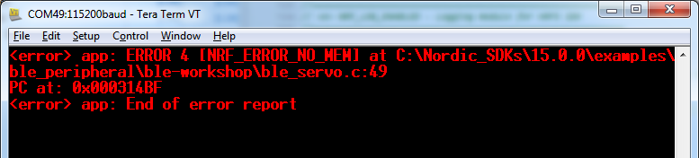
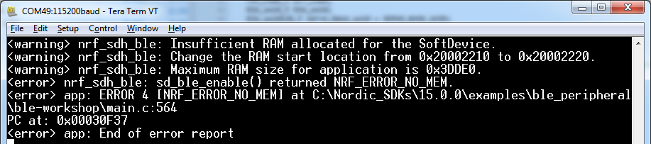
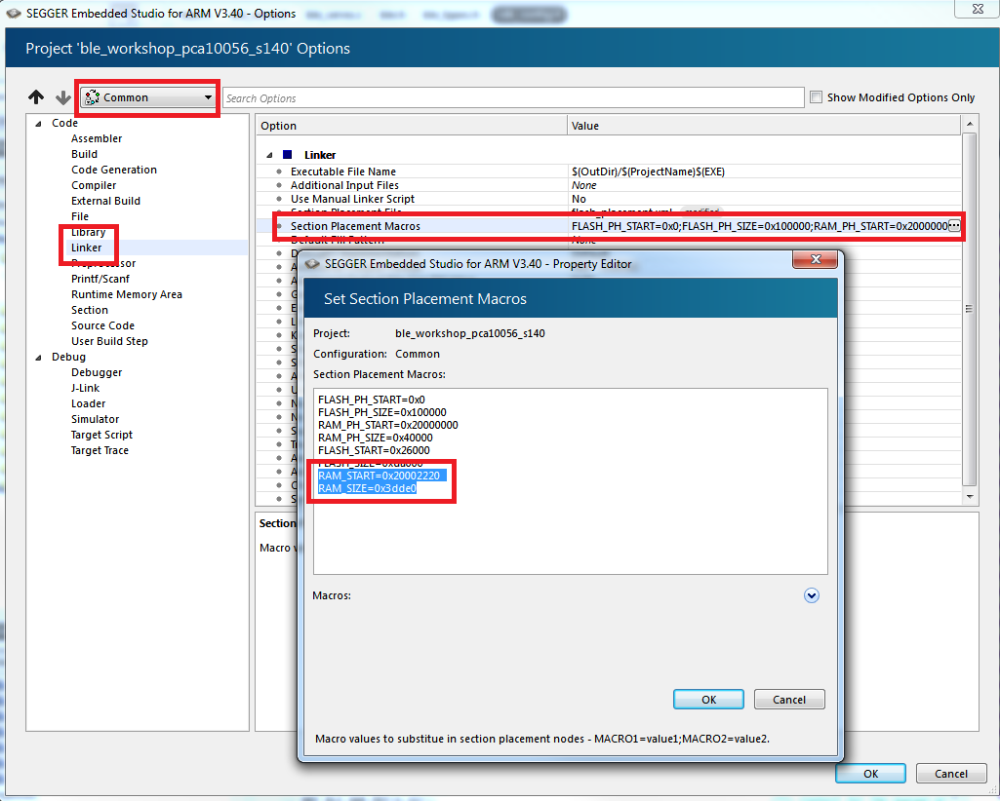
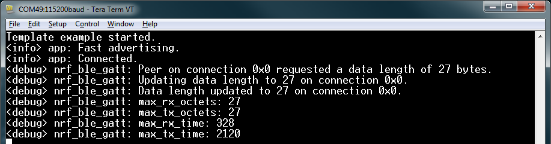

# Part 3: Adding a BLE Service
In this part we will add a service and a characteristic that we can use to control our servo. Adding services and characteristics can be a complex task with a lot of things to consider, such as security aspects, characteristic properties, etc. However, since this workshop is so short we will just power through and skip everything that has to do with security and low level configurations, and just implement the bare minimum of what we need. 

1. Add ble_servo.c to your project files and include 


1. When you now compile and download your code you might see an error like this:

    

1. So what is this? Can you figure it out by looking up the function that returned the error on infocenter.nordicsemi.com?


1. To allocate enough RAM to the Softdeivce it needs to know how many vendor specific UUIDs we are going to use. We do this in _sdk_config.h_ by setting:

    ````c 
    #define NRF_SDH_BLE_VS_UUID_COUNT 1
    ````

1. When you recompile and download the code again, the NO_MEM error should be gone, but replaced by a new one:

    

1. This error basically tells us that we have allocated too little RAM for the Softdevice in our project settings. So once again, go to Edit Options and do as the error says; change 
RAM_START and RAM_SIZE to 0x20002220 and 0x3dde0 respectively:
    

1. Now, you should be able to compile, download, and connect to your device. And when you do, the output on your Serial terminal should show you something like this:

    

    