# Part 1: Getting familiar with Segger Embedded Studio
This first part of the workshop is intended to give a very quick introduction to the look and feel of Segger Embedded Studio and to give you an idea about how it is to work with Nordic's SDK. 

## Open and build a project
1. Make sure that you have downloaded and extracted SDK 15 to your harddrive. <span style="color:red">Make sure that the path to the SDK folder isn't too long</span>, or your projects might not compile. For example, this

    _"C:\SDK_15\"_

    is better than this:

    _"C:\subfolder1\subfolder2\subfolder3\subfolder4\subfolder5\subfolder6\SDK_15\"_

    
1. Navigate to the folder _"..\your_sdk_15_folder\examples\ble_peripheral\"_ and make a copy of the folder _"ble_app_template"_. Call the new folder _"workshop"_. This folder contains the [BLE Template Application](http://infocenter.nordicsemi.com/topic/com.nordic.infocenter.sdk5.v15.0.0/ble_sdk_app_template.html?cp=4_0_0_4_1_2_23)  which we will use to get started. The example initiates the Softdevice and starts advertising, but there are no BLE services or characteristics added. We will add that later. 

1. Open up the SES project file. You will find it in this path: _"..\your_sdk_15_folder\examples\ble_peripheral\workshop\pca10056\s140\ses\ble_app_template_pca10056_s140.emProject"_
    * pca10056 signifies that the example uses the PCA10056 development kit, also known as nRF52840 DK. 
    * S140 signifies that the example uses Softdevice S140

1. To build your project, click 'Build->Build "_name of project_"' (or click F7 on windows).
    
    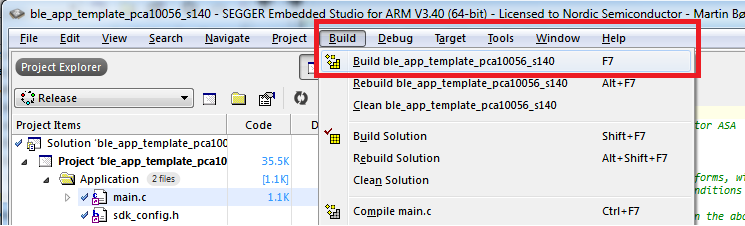

1. When the build finishes, notice how SES shows you how much Flash and RAM is being used by your application (the output window says we are using 192 KB of flash, but note that this includes the S140 Softdevice which is 152 kB alone).
    
    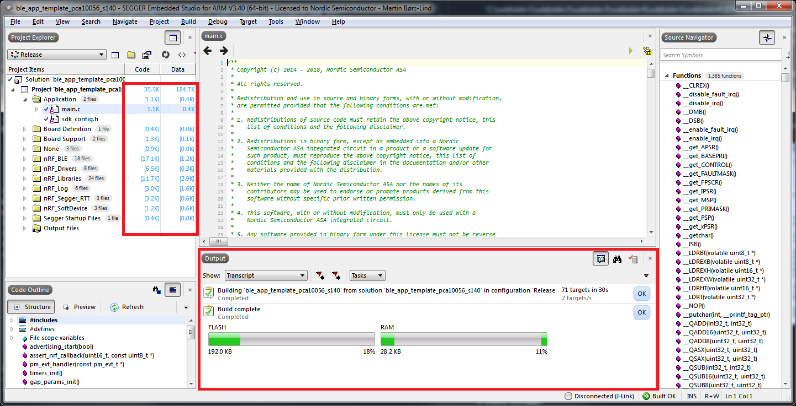

## Test the example code
1. Now let us test the example code. Click 'Target->Download "_name of project_"'. This will program both the Softdevice and the application code to your nRF52840 DK. 

    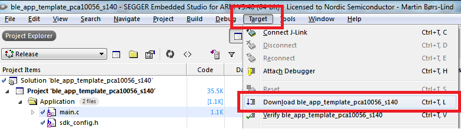

1. You should now see that LED1 on the nRF52840 DK is blinking periodically. This indicates that the application is running and the device is advertising. 

1. Open up [nRF Connect for Mobile](https://www.nordicsemi.com/eng/Products/Nordic-mobile-Apps/nRF-Connect-for-Mobile) and start scanning. Your device should show up in the device list:

    

1. You might want to make the advertising name more unique to help recognize your device. You can do this by modifying the ``DEVICE_NAME`` define in main.c:

    ```c
        #define DEVICE_NAME "Unique name"  /**< Name of device. Will be included in the advertising data. */
    ```
    After recompiling and reprogramming the project, your device should appear with its new name in the list.


# Experiment with the logger module
Most of the examples in the SDK utilize the [Logger Module](http://infocenter.nordicsemi.com/topic/com.nordic.infocenter.sdk5.v15.0.0/lib_nrf_log.html?cp=4_0_0_3_26) to print error, debug, and information messages to either a UART terminal (like PuTTy) or Segger's own [Real Time Transfer](https://www.segger.com/products/debug-probes/j-link/technology/about-real-time-transfer/) (RTT). The logger module is quite versatile and customizable so let us try out a few basic things.
1. Open the file called _sdk_config.h._ This file is used to configure a wide range of parameters in the drivers and libraries included in the SDK. You can read more about how the file can be used [here](http://infocenter.nordicsemi.com/topic/com.nordic.infocenter.sdk5.v15.0.0/sdk_config.html?cp=4_0_0_1_7). 
1. Make sure that the Logger Module is enabled by searching for ``NRF_LOG_ENABLED`` in _sdk_config.h_ and make sure it is defined as 1.

    ````c
        #define NRF_LOG_ENABLED 1
    ````
1. Next, make sure that UART is selected as backend for the Logger Module by setting `NRF_LOG_BACKEND_UART_ENABLED` to 1. Recompile your code and reprogram your kit.

1. Open up a serial terminal (e.g. PuTTy) and connect to your DK's COM port (default baud rate is 115200). You should see something like this

    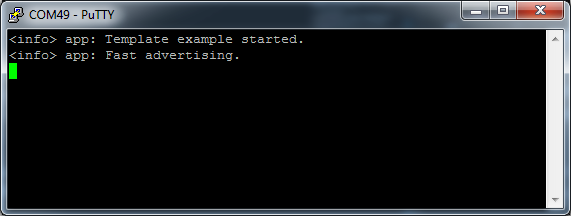

    If you don't see any messages you might need to reset the application by pressing the BOOT/RESET button on the kit.

1. Set the build configuration to 'Debug'. This will provide more useful information to be printed out to serial terminals, and it also makes it easier to step through your code with a debugger. 

    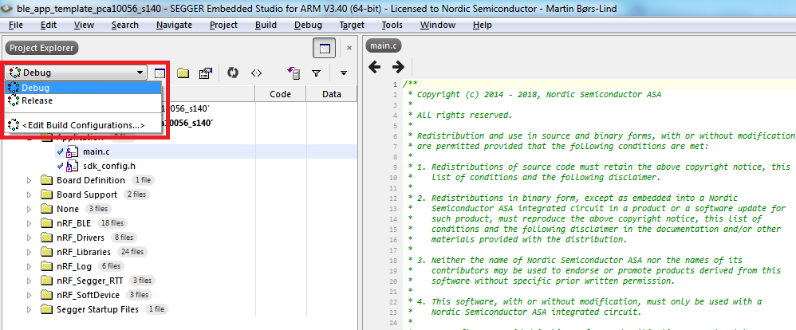

1. Recompile your project and notice how this signifficantly increases the code size. 

1. The Logger Module allows you to print messages of different severity. Try to add these three lines of code:
    ````c
        ....
        peer_manager_init();

        // Start execution.
        NRF_LOG_INFO("Template example started.");
        // Add THESE LINES
        NRF_LOG_ERROR("This is an ERROR message.");
        NRF_LOG_WARNING("This is a WARNING message.");
        NRF_LOG_DEBUG("This is a DEBUG message.");
        ....
    ````

    Now you should see this output on your terminal:

    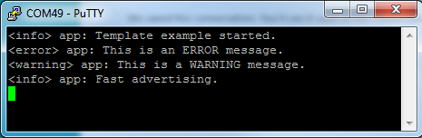

    Note how there seems to be a missing message! Why is there no message saying `"This is a DEBUG message."`? It is missing because the default severity level is set to "info" in _sdk_config.h_. With this severity level only warnings, errors, and info messages are printed. We can change this by finding `NRF_LOG_DEFAULT_LEVEL` in _sdk_config.h_ and set it to 4 (Debug). When you recompile the project you should see this in your serial terminal:

    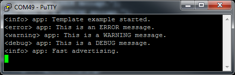


# How to use the error handler
One more thing that is extensively used in the SDK, and something goes hand in hand with the Logger Module, is the [Error Module](http://infocenter.nordicsemi.com/topic/com.nordic.infocenter.sdk5.v15.0.0/lib_error.html?cp=4_0_0_3_13). Throughout the entire SDK you will see that functions return error codes and that these error codes can be checked with the macro: ``APP_ERROR_CHECK(error code)``.
1. So try to add this code after the logging messages: ``APP_ERROR_CHECK(1234)``.

    ````c
         // Start execution.
        NRF_LOG_INFO("Template example started.");
        NRF_LOG_ERROR("This is an ERROR message.");
        NRF_LOG_WARNING("This is a WARNING message.");
        NRF_LOG_DEBUG("This is a DEBUG message.");
        
        APP_ERROR_CHECK(1234);
    ````

    When you run the application now, you should see an error message printed on your terminal:

    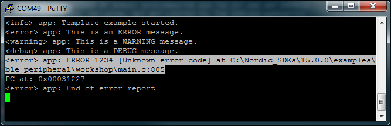
    
    The error message shows the error code and where the code that produced the error is located. In this case it is error number 1234 and the code that produced the error is located at line 805 in main.c.

1. Try to replace `APP_ERROR_CHECK(1234);` with this code:

    ````c
        uint32_t err_code = nrf_sdh_enable_request();
        APP_ERROR_CHECK(err_code);
    ````

    What happens now? You should get another error:
    
    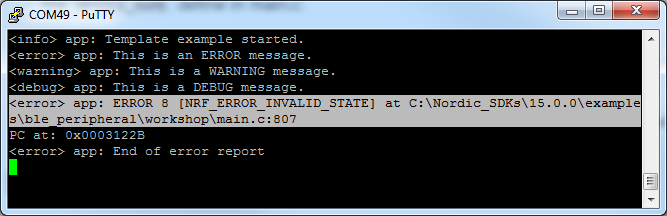

    Here you can see that we get error 8 in return when we call the function ``nrf_sdh_enable_request()``. When you get errors like this, the first thing you should do is to go to [infocenter.nordicsemi.com](http://infocenter.nordicsemi.com/) and look up the documentation for the function that returned the error. The documentation for [nrf_sdh_enable_request()](http://infocenter.nordicsemi.com/topic/com.nordic.infocenter.sdk5.v15.0.0/group__nrf__sdh.html#ga574d17fdf1c59dec6355e3f525c484ec) tells us that we get error 8, ``NRF_ERROR_INVALID_STATE``, because the SoftDevice is already enabled.


# Bonus tasks
<details><summary>Use RTT as backend</summary>

1. Disable UART as backend by setting `NRF_LOG_BACKEND_UART_ENABLED` to 0 and instead turn on the RTT backend by setting `NRF_LOG_BACKEND_RTT_ENABLED` to 1. Recompile your code.

1. Start a debugging session and use SES's integrated Debug Terminal to see the debug information.

    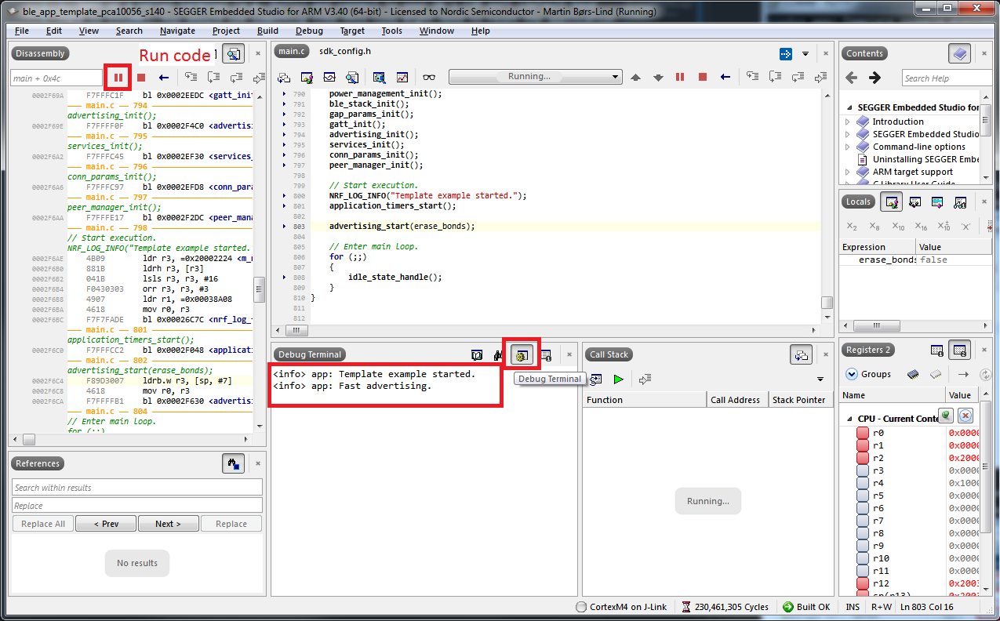

1. Enable colors by setting ``NRF_LOG_USES_COLORS`` to 1. Your debug messages should now appear like this:
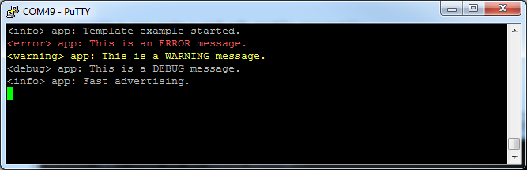

</details>

[Link](./Part_2.md)