# Part 3: Adding a BLE Service
In this part we will add a service and a characteristic that we can use to control our servo. Adding services and characteristics can be a complex task with a lot of things to consider, such as security aspects, characteristic properties, etc. However, since this workshop is so short we will just power through and skip everything that has to do with security and low-level configurations, and just implement the bare minimum of what we need. 

To save time I have taken the liberty of writing almost all the necessary code. However, we will go through the process of 

## Initialize the service

1. First, add _ble_servo.c_ to your project files. It should be located in the project's root folder together with main.c. 

1. Declare a ``ble_servo_t`` structure somewhere at the top of main.c.     

    ````c
    ble_servo_t m_ble_servo;
    ````
    This structure type is defined in _ble_servo.h_ and will be used to store:

    - Attribute handle to our characteristic
    - Attribute handle to our service
    - Information about the service's base UUID
    - A reference to an event handler function

1. To initialize the Servo Service, simply call ``ble_servo_service_init()`` and pass in a pointer to our servo structure. In the SDK, all services are usually initialized in a common function called ``services_init()`` located in _main.c_. So, do something like this:

    ````c
    static void services_init(void)
    {
        //TODO PART 3: Initialize the Servo Service
        ble_servo_service_init(&m_ble_servo);
        ...
    ````

1. ``ble_servo_service_init()`` is defined in _ble_servo.c_ and it does two things:
    
    1. It uses [sd_ble_uuid_vs_add()](http://infocenter.nordicsemi.com/topic/com.nordic.infocenter.s132.api.v6.0.0/group___b_l_e___c_o_m_m_o_n___f_u_n_c_t_i_o_n_s.html#ga265b4251110a15120d0aa97e5152163b) to add a vendor specific base UUID to the BLE stack's table of UUIDs, for later use with all other modules and APIs. Our UUIDs are defined in _ble_servo.h_ and the base UUID, ``SERVO_BASE_UUID``, is F364xxxx-01B0-4240-BA50-05CA55BF8ABC and the 16-bit alias UUID for the service, ``SERVO_SERVICE_UUID``, is 0x5E55.
    2. It uses [sd_ble_gatts_service_add()](http://infocenter.nordicsemi.com/topic/com.nordic.infocenter.s132.api.v6.0.0/group___b_l_e___g_a_t_t_s___f_u_n_c_t_i_o_n_s.html#ga39fea660228e4b2e788af7018a83927a) to add a service declaration to the Attribute Table

1. When you now compile and download your code you might see an error like this:

    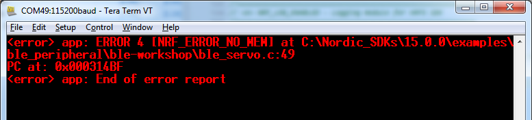

1. So what is this? The amount or RAM required by the SoftDevice  is dependent on how you configure it. More links and higher throughputs require more RAM. A large attribute table with lots of services and/or characteristics also requires more RAM. What is happening here, is that [sd_ble_uuid_vs_add()](http://infocenter.nordicsemi.com/topic/com.nordic.infocenter.s132.api.v6.0.0/group___b_l_e___c_o_m_m_o_n___f_u_n_c_t_i_o_n_s.html#ga265b4251110a15120d0aa97e5152163b) is returning error NRF_ERROR_NO_MEM because we have not told the SoftDevice  to allocate memory for vendor specific UUIDs.

1. To allocate more RAM to the Softdeivce, it needs to know how many vendor specific UUIDs we are going to use. We do this in _sdk_config.h_ by setting:

    ````c 
    #define NRF_SDH_BLE_VS_UUID_COUNT 1
    ````

1. When you recompile and download the code again, the NO_MEM error should be gone, but replaced by a new one:

    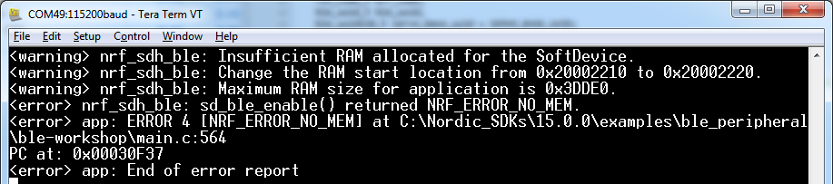

1. This error basically tells us that we have allocated too little RAM for the SoftDevice  in our project settings. So once again, go to Edit Options and do as the error says; change 
RAM_START and RAM_SIZE to 0x20002220 and 0x3dde0 respectively:
    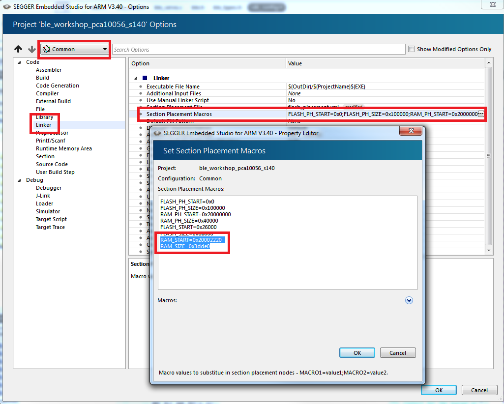

1. Now, you should be able to compile, download, and connect to your device. And when you do, the output on your Serial terminal should show you something like this:

    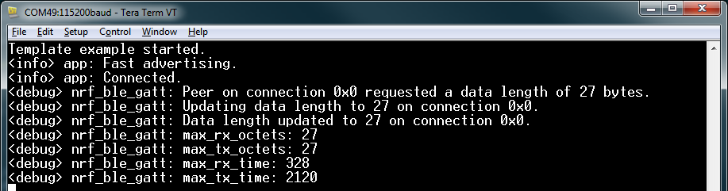

## Connect to your device with nRF Connect for Mobile

1. Open up nRF Connect for Mobile and scan for devices. You should see something like this:

    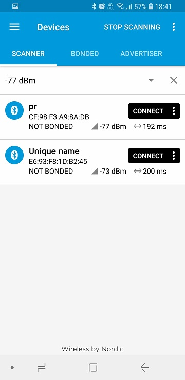

1. Click "Connect" on your device. Now you should see this:

    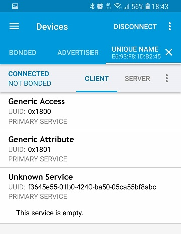

    Here you see:
    1. The [Generic Access Service](https://www.bluetooth.com/specifications/gatt/viewer?attributeXmlFile=org.bluetooth.service.generic_access.xml) which contains generic information about the device. If you click on it, you can e.g. see the device name. It is mandatory in any BLE applications and hence, added automatically by the Softdeivce.
    2. The [Generic Attribute Service](https://www.bluetooth.com/specifications/gatt/viewer?attributeXmlFile=org.bluetooth.service.generic_attribute.xml) It is also mandatory and added automatically by the Softdeivce.
    3. Our custom Servo Service. If you click on it you will see that the service is empty.


## Initialize the characteristic
So let us add something to our service.

1. At the bottom of ``ble_servo_service_init()``, make a call to the function ``servo_char_add()``

1. ``servo_char_add()`` does several things:

    1. In enables write properties. 
    1. It leaves the doors wide open for everyone to write to our characteristic with the macro ``BLE_GAP_CONN_SEC_MODE_SET_OPEN()`` (no security at all)
    1. It disables read permissions.
    1. It configures the SoftDevice  to store our characteristic values in memory controlled by the SoftDevice  (stack). 
    1. It configures the initial and maximum length of our characteristic values. In our case we only need to fit a 16 bit wide ``uint16_t`` variable to control our servo. 
    1. It uses [sd_ble_gatts_characteristic_add](http://infocenter.nordicsemi.com/topic/com.nordic.infocenter.s132.api.v6.0.0/group___b_l_e___g_a_t_t_s___f_u_n_c_t_i_o_n_s.html#ga9ee07ea4b96dcca1537b01ff9a7692ba) to add a characteristic declaration and a characteristic value declaration to the attribute database.

1. After recompiling and downloading your code, you should see this when you connect to the device again:

    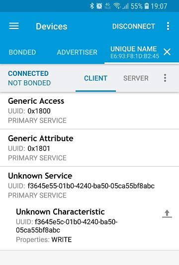

    As you can see, we now have a characteristic included in our service. You should also recognize the UUIDs from the UUIDs we defined in _ble_servo.h_. You can also see that the characteristic only supports the WRITE property. 


## Receive BLE Write events
Next we want to write values to our characteristic with nRF Connect. The SoftDevice  is completely event driver, and whenever we write any data to any characteristic the SoftDevice  will generate a write event. What we need to do is to response to listen for the write event and whenever such an event occur we need to figure out which characteristic was written to. 

1. To catch the write events (defined as `BLE_GATTS_EVT_WRITE` in the SoftDevice  API), we are going to use the function called `ble_servo_on_ble_evt()` which is defined in _ble_servo.c_. In _main.c_, there is an event handler function called `ble_evt_handler()`. When the SoftDevice is being initialized, this function is registered as a handler for all BLE events (have a look in ``ble_stack_init()``). At the bottom of ``ble_evt_handler()``, make a call to `ble_servo_on_ble_evt()` and pass in a pointer to our `m_ble_servo` structure and a pointer to ``p_ble_evt``, which is a structure containing data about BLE events:

    ````c
    //TODO PART 3: Forward BLE events to ble_servo_on_ble_evt()	
    ble_servo_on_ble_evt(p_ble_evt, &m_ble_servo);
    ````

    This way we will forward BLE events from _main.c_ to _ble_servo.c_:


1. A function like `ble_servo_on_ble_evt()` is used in pretty much every BLE example in the SDK and it just contains a switch-case statement that sorts the different events. Inside the `BLE_GATTS_EVT_WRITE` case there is a call to ``on_write_event()`` (which is also common practice in the SDK).

1. The function ``on_write_event()`` does a couple of things:

    1. It extracts the relevant parameters and variables, like the data length and the data itself, from the `p_ble_evt` structure.
    1. It checks whether the write event writes data to our Servo characteristic. 
    1. If the write event does indeed concern our Servo characteristic, it assembles the received data. 
    1. It prints some information messages to the Logger module (watch out for those in your terminal).
    1. Forwards the received servo value to the Servo Service event handler. 


1. To write data to our characteristic using nRF Connect for Mobile, click the upwards facing arrow to the right of our characteristic:

    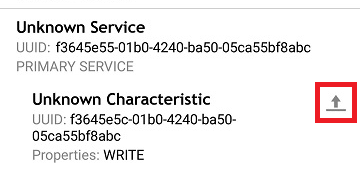
1. Then type in the value you want to send. Note that the value is in hexadecimal format:

    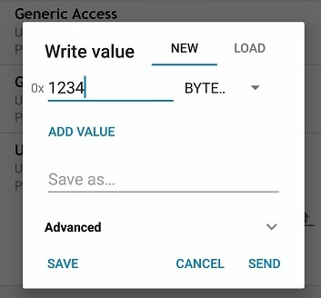

    Remember that the servo value is 16 bits wide.  

1. Click send. Did anything happen? If things are going according to plan you should see this on your terminal:

    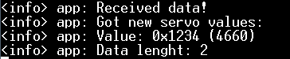

## Control the servo

1. Now there is just one more thing to do. We need to make sure that our Servo Service event handler is calling the ``set_servo_value()`` function that we created previously. Do this by going back to `services_init()` in _main.c_ and make `m_ble_servo.evt_handler` point to the function like this:

    ````c
    static void services_init(void)
    {
        //TODO PART 3: Configure Servo Service event handler 
        m_ble_servo.evt_handler = set_servo_value;
        //TODO PART 3: Initialize the Servo Service
        ble_servo_service_init(&m_ble_servo);
    }
    ````

    Depending on where you have defined your ``set_servo_value()`` function, you might get a compiler error complaining about 
    
        "'set_servo_value' undeclared (first use in this function)"

    If you get this, you can make a forward declaration of ``set_servo_value()`` at the top of main:

    ````c
    //TODO PART 3: Make a forward declaration of set_servo_value()
    void set_servo_value(uint16_t servo_value);
    ````

1. Now you should see messages like these on your serial terminal:

    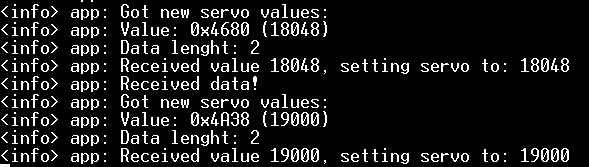

    And if you have your servo connected, it should jump around when you send your data. 

    Minimum servo value: 18,000 DEC = 0x4680 HEX

    Maximum servo value: 19,000 DEC = 0x4A38 HEX